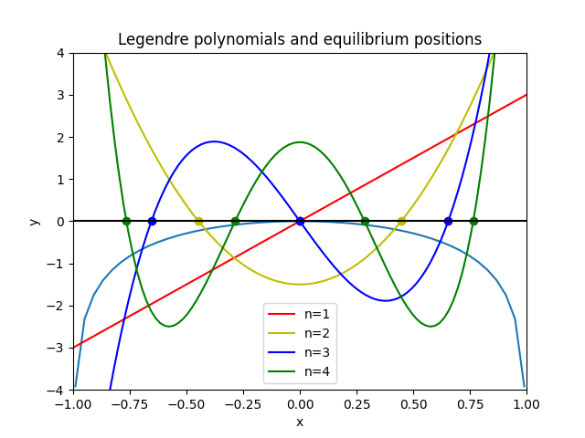
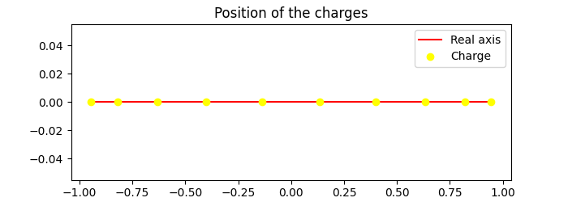

# Project 4

## Authors:

- Salim Bekkari
- Mohammed Boudali
- Imad Boudroua
- Simon Bullot
- Lucas Guédon

## Chosen subjects:

- Computation of the Lagrangian points
- Electrostatic equilibrium

## Requirements to run the project:

- Python
- Numpy
- Matplotlib

## Content of the project:

- newton_raphson.py:  
Contains the function Newton_Raphson, which solves non-lineare systems of equations

- lagrangian.py:  
Contains functions to create forces and compute lagrangian points

- electrostatic_equilibrium.py:  
Contains functions to compute the electrostatic equilibrium points

